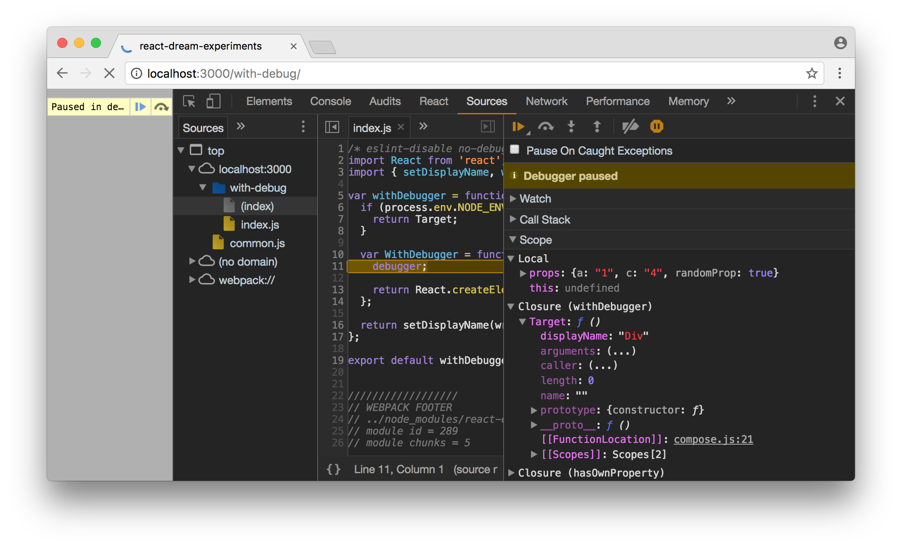

**index.js**

```js
import React from 'react'
import { render } from 'react-dom'
import { Html } from 'react-dream'

const App = Html.Div
  .removeProps('a', 'c', 'randomProp')
  .debug()
  .addProps(() => ({
    a: '1',
    c: '4'
  }))
  .fork(AppComponent => render(
    <AppComponent randomProp />,
    document.getElementById('root')
  ))
```
